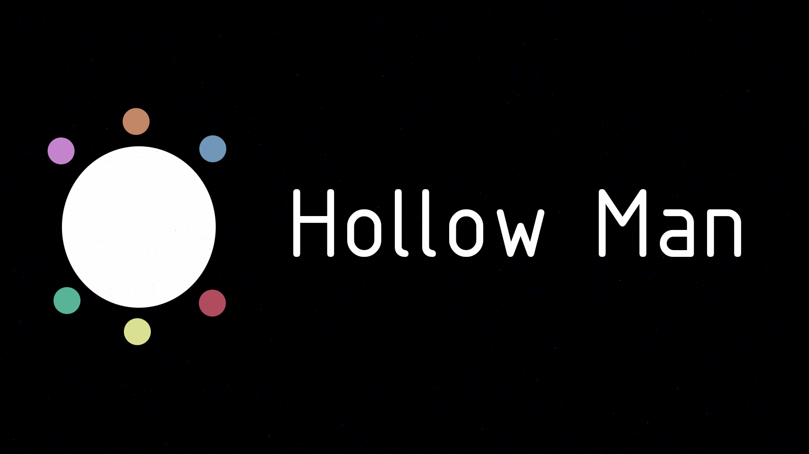

# Hollow 图片（视频）信息隐藏加解密软件 (Hollow Software for Picture Video Information Hiding Encryption and Decryption)

[](../../graphs/commit-activity)
[](../../releases)

[](https://github.com/HollowMan6?tab=followers)
[](../../watchers)
[](../../stargazers)
[](../../network/members)

[](https://hollowman6.github.io/fund.html)
[](https://opensource.org/licenses/GPL-3.0/)
[](../../archive/master.zip)

(All the documents and software are in Chinese)

***此软件申请了软件著作权。***

***This software has applied for software copyright.***

[Python库依赖(Python library dependency)](../../network/dependencies)

本软件部分参考了[蔡銘峯](https://github.com/parkmftsai)的[Digital Watermarking](https://github.com/parkmftsai/digital_watermarking)项目，并在其基础上做出了大量改进。本软件适用于视频和图片的信息隐藏加解密，具体设计说明原理和使用方法请参考[此说明文档](计算机软件著作权登记申请/设计说明书.pdf)

In the software part, I refer to [digital watermarking](https://github.com/parkmftsai/digital_watermarking) project of [Cai Mingyi](https://github.com/parkmftsai), and make a lot of improvements on the basis of it. This software is applicable to the encryption and decryption of video and picture information hiding. Please refer to [this instruction document（in Chinese）](计算机软件著作权登记申请/设计说明书.pdf) for the specific design description and user instruction.

[这里](qt-design)为QT Designer的UI设计和资源文件，要将UI文件转化为Python脚本，请使用以下命令：

[Here](qt-design) is the UI design and resource file of QT designer. To convert the UI file to Python script, use the following command:

```Shell
pyuic5 -o *.py *.ui
```

要将QRC文件转化为Python脚本，请使用以下命令：

To convert a QRC file to a python script, use the following command:

```Shell
pyrcc5 -o *.py *.qrc
```

[这里](code)为源代码和程序中用到的图片资源文件。

[here](code) is the source code and the image resource file used in the program.

[这里](test)为测试样例，我使用了7张[图片](test/raw-pic)进行效果测试：

[here](test) as a test sample, I used 7 [pictures](test/raw-pic) to test the effect:


这是要隐藏的[图片](test/hidden-pic.jpg)：

This is the [picture](test/hidden-pic.jpg) to hide:


[此文件夹](test/de-encrypted-pic)保存了图片加密还原过程中的一系列产物。

[this folder](test/de-encrypted-pic) stores a series of products in the process of image encryption and restoration.

这是经过加密后的图片,解密的辅助还原信息保存在文件夹下的npy文件：

This is the encrypted picture. The decrypted secondary restore information is saved in the NPY file under the folder:


这是解密出的隐藏信息：

This is the decrypted hidden information:





# 软件著作权申请(Applying for Software Copyright in China)

[计算机软件著作权登记申请](计算机软件著作权登记申请)文件夹下存放了此软件的有关申请文档，仅供参考。具体申请步骤请查看[官网](http://www.ccopyright.com/index.php?optionid=1033)。

The folder [计算机软件著作权登记申请](计算机软件著作权登记申请) stores the relevant application documents of this software for reference only. Please refer to [Official Website](http://www.ccopyright.com/index.php?optionid=1033) for specific application steps.
